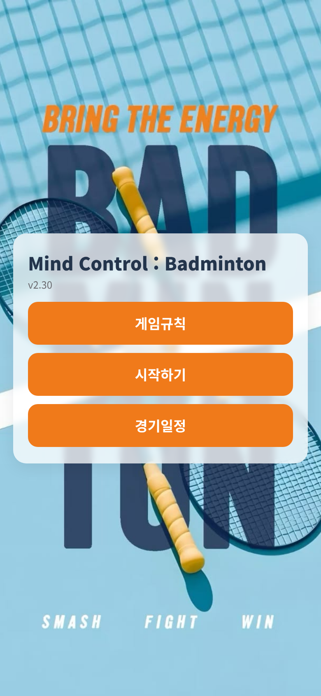
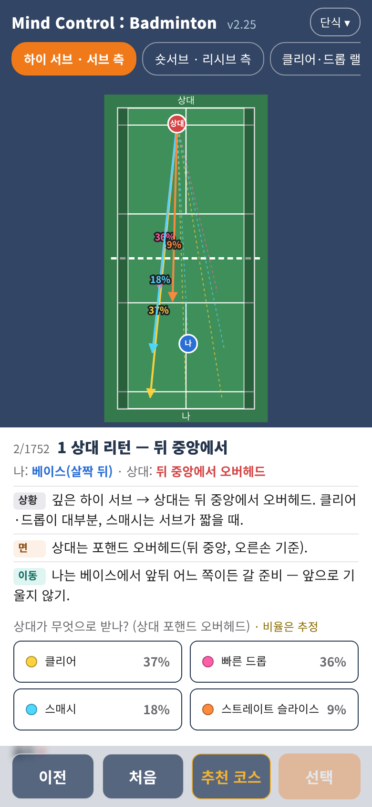
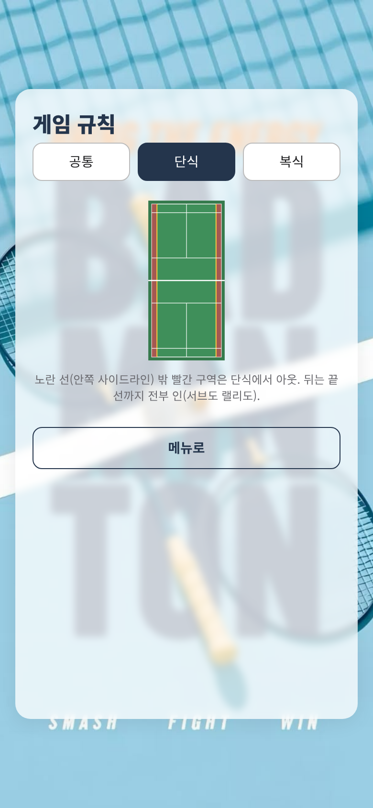

# Mind Control : Badminton

상황 데이터 기반 배드민턴 전술 학습 시뮬레이터. 랠리 중 마주치는 매 순간을 코트 다이어그램과 함께 보여주고, "상대가 다음에 무엇을 칠지, 나는 무엇을 준비해야 하는지"를 실제 코칭 자료에 근거한 추정 확률로 반복 학습한다.

<p align="center">
  
  
</p>
<p align="center">
  
  
</p>

## 특징

- **상황 기반 분기 트리** — 서브부터 랠리 전개까지, 코트 위 궤적·이동·타점 설명과 함께 다음 선택지를 제시
- **출처 있는 추정** — 표시되는 확률은 전부 "추정치"이며 배드민턴 코칭 자료 출처를 근거로 둔다. 승률 통계가 아니라 학습 참고값
- **단식 · 남복/여복 복식 · 혼복** 지원, 급수(D조~A조)별 전술·확률 보정
- **추천 코스 자동 재생** — 대표 랠리 전개를 자동으로 따라가며 흐름을 익히는 모드
- **게임 규칙 안내** — 공통/단식/복식 규칙을 코트 다이어그램과 함께 쉽게 설명(BWF 공식 규칙 근거)
- **경기 일정 캘린더** — 서울·경기 지역 동호인 대회 일정을 월 캘린더로 확인, 날짜별 대회 정보와 링크 제공
- **단일 파일 배포** — 빌드 도구 없이 `mobile/index.html` 하나로 완결(영상·이미지 자산 내장), iOS Safari에서 바로 동작

## 프로젝트 구조

```
mobile/           배포 대상 — 단일 파일 뷰어(index.html)와 외부 서빙용 영상 자산
assets/           원본 소스 자산(오프닝 영상, 포스터, 배경 이미지 등)
scripts/          데이터 검증 · 스크린샷 자동화 스크립트(Node.js + Playwright)
docs/             기획·설계 참고 자료
DESIGN.md         버전별 변경 이력과 근거 — 요청 → 적용 → 검증 순으로 기록
wireframe.html    초기 화면 구조 와이어프레임
```

## 로컬 실행

정적 파일 하나로 동작하므로 별도 빌드 없이 바로 서빙한다.

```bash
node scripts/static-server.mjs mobile 8088
# http://localhost:8088/ 접속 (0.0.0.0 바인딩, HTTP Range 지원 — iOS 영상 재생 확인 가능)
```

## 데이터 검증

시나리오 데이터(노드 연결, 갈래 확률, 코스 방향, 설명 문구)는 커밋 전 아래 스크립트로 자동 검사한다.

```bash
node scripts/check-data.mjs mobile/index.html         # 갈래 연결 · 출처 키 · 급수 보정 등 전반 무결성 검사
node scripts/check-recommended.mjs mobile/index.html  # 추천 코스 자동 재생 경로 검사
node scripts/check-course-dir.mjs                      # 코스(좌/우 스트레이트·크로스) 방향 일관성 검사
node scripts/note-stats.mjs mobile/index.html          # 상황 설명 문구 길이 · 형식 검사
```

## 기술 스택

바닐라 JavaScript + SVG 코트 렌더링, 별도 프레임워크·번들러 없음. 검증·촬영 도구는 Node.js + Playwright.

## 배포

Vercel 정적 배포(`vercel.json`의 `outputDirectory: mobile` 기준).
